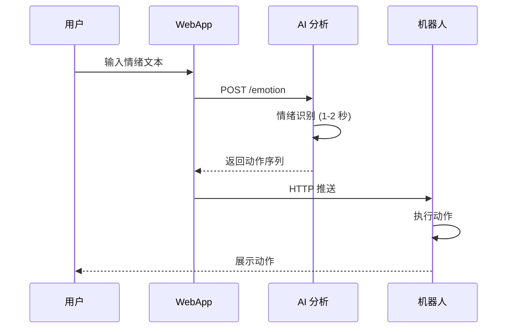
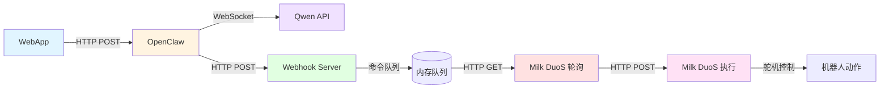

# 🦾 情绪驱动机器人项目 - 核心信息总览

**版本**：v1.0  
**最后更新**：2026-04-26  
**用途**：为计划书、设计报告、汇报 PPT 提供统一技术参考

---

## 1. 项目一句话概述

> 通过 AI 实时识别用户情绪，自动生成机器人动作序列，实现自然的情感化人机交互。

---

## 2. 系统架构

### 2.1 整体架构图

```
┌─────────────────────────────────────────────────────────────────────────┐
│                            用户交互层 (Frontend)                         │
│  ┌─────────────────────────────────────────────────────────────────┐    │
│  │                        WebApp (情绪输入)                          │    │
│  │   - 情绪文本输入框 / 语音输入 (可选)                               │    │
│  │   - 实时状态显示 (分析中/执行中/完成)                              │    │
│  │   - 历史情绪记录 (可选)                                           │    │
│  └─────────────────────────────────────────────────────────────────┘    │
└─────────────────────────────────────────────────────────────────────────┘
                                    ↓ HTTP POST /emotion
┌─────────────────────────────────────────────────────────────────────────┐
│                          AI 分析层 (OpenClaw)                            │
│  ┌──────────────────┐         ┌──────────────────┐                     │
│  │  robot-behavior  │  ───→   │ json-webhook-    │                     │
│  │      Skill       │         │     skill        │                     │
│  │  (情绪识别)      │         │   (Webhook 推送)  │                     │
│  └──────────────────┘         └──────────────────┘                     │
│         ↓                              ↓                                │
│  qwen3.5-omni-plus-              HTTP POST                             │
│  realtime (WebSocket)            动作序列 JSON                          │
└─────────────────────────────────────────────────────────────────────────┘
                                    ↓ HTTP POST
┌─────────────────────────────────────────────────────────────────────────┐
│                        硬件执行层 (Milk DuoS)                            │
│  ┌─────────────────────────────────────────────────────────────────┐    │
│  │                    轮询服务 (Polling Service)                      │    │
│  │   - 每 2 秒 GET /poll 获取待执行命令                                │    │
│  │   - 命令队列管理 (FIFO)                                           │    │
│  │   - ACK 确认机制 (POST /ack)                                      │    │
│  └─────────────────────────────────────────────────────────────────┘    │
│                                    ↓                                     │
│  ┌─────────────────────────────────────────────────────────────────┐    │
│  │                    Milk DuoS 开发板                               │    │
│  │   - 11 个基础动作 (站立/挥手/摇头/致谢/交通指挥/舞蹈/自由飞翔/下蹲/前进/后退) │
│  │   - 串口/蓝牙控制舵机                                             │    │
│  └─────────────────────────────────────────────────────────────────┘    │
└─────────────────────────────────────────────────────────────────────────┘
```

### 2.2 技术栈总览

| 层级 | 组件 | 技术选型 | 说明 |
|------|------|---------|------|
| **前端** | WebApp | React/Vue/原生 HTML | 用户情绪输入界面 |
| **中台** | OpenClaw | Node.js + 自研 Skill | AI 分析引擎 |
| **AI 模型** | 情绪识别 | qwen3.5-omni-plus-realtime | 通义千问实时多模态 (WebSocket) |
| **推送** | Webhook | 自研 HTTP 服务 | 队列管理 + 命令追踪 |
| **硬件** | 开发板 | Milk DuoS | 11 自由度舵机控制 |
| **通信** | 轮询 | HTTP GET/POST | 穿透 NAT，部署简单 |

---

## 3. 核心数据流

### 3.1 完整请求链路

```
Step 1: WebApp 提交情绪
────────────────────────
POST http://<openclaw-host>/emotion
Content-Type: application/json

{
  "input_type": "text",
  "content": "我今天很开心",
  "session_id": "user_001"  // 可选
}


Step 2: robot-behavior 分析
────────────────────────────
调用：qwen3.5-omni-plus-realtime (WebSocket)
延迟：1-2 秒
成本：约 ¥0.01/次

返回:
{
  "status": "success",
  "action_sequence": [1, 6, 0],
  "action_names": ["挥手", "舞蹈歌曲", "站立"],
  "emotion_detected": "happy",
  "rationale": "检测到'开心'情绪，选择挥手和舞蹈动作表达喜悦"
}


Step 3: json-webhook-skill 推送
────────────────────────────────
POST http://192.168.1.xxx:8765/action/milk_duos_001
Content-Type: application/json

{
  "action_sequence": [1, 6, 0],
  "command_id": "cmd_abc123",
  "timestamp": 1714104000000
}


Step 4: Duo 板轮询获取
──────────────────────
GET http://192.168.1.xxx:8765/poll/milk_duos_001
间隔：每 2 秒

返回:
{
  "commands": [
    {
      "command_id": "cmd_abc123",
      "action_sequence": [1, 6, 0],
      "status": "pending"
    }
  ]
}


Step 5: Duo 板执行 + 确认
──────────────────────────
执行动作序列 (每个动作间隔 500ms)
完成后:
POST http://192.168.1.xxx:8765/ack/cmd_abc123
{ "status": "completed" }
```

### 3.2 时序图 (Mermaid)

```mermaid
sequenceDiagram
    participant WebApp
    participant OC as OpenClaw
    participant Qwen as Qwen API
    participant WH as Webhook Server
    participant DuoS as Milk DuoS

    Note over WebApp,DuoS: 情绪驱动机器人完整时序

    WebApp->>OC: POST /emotion<br/>{content: "我很开心"}
    activate OC
    
    OC->>Qwen: WebSocket: session.update<br/>system prompt
    Qwen-->>OC: 配置确认
    
    OC->>Qwen: WebSocket: conversation.item.create<br/>用户情绪文本
    OC->>Qwen: WebSocket: response.create
    
    Note over Qwen: AI 情绪分析<br/>(1-2 秒)
    
    Qwen-->>OC: response.text.done<br/>{action_sequence: [1,6,0]}
    deactivate Qwen
    
    OC->>WH: POST /action/milk_duos_001<br/>{action_sequence, command_id}
    activate WH
    WH-->>OC: 200 OK {queued: true}
    deactivate WH
    
    OC-->>WebApp: 200 OK<br/>{emotion: "happy", actions: [1,6,0]}
    deactivate OC
    
    Note over DuoS,WH: 轮询阶段 (每 2 秒)
    
    DuoS->>WH: GET /poll/milk_duos_001
    WH-->>DuoS: {commands: []}
    
    Note over DuoS: 等待 2 秒
    
    DuoS->>WH: GET /poll/milk_duos_001
    WH-->>DuoS: {commands: [{command_id, actions}]}
    
    Note over DuoS: 执行动作序列<br/>每个动作间隔 500ms
    
    DuoS->>WH: POST /ack/cmd_xxx<br/>{status: "completed"}
    WH-->>DuoS: 200 OK
```

### 3.3 简化版时序图 (用于 PPT)



### 3.4 模块交互图



---

## 4. 情绪 - 动作映射规则

### 4.1 7 种基础情绪

| 情绪 ID | 中文 | 关键词 | 强度修饰词 |
|--------|------|--------|-----------|
| happy | 开心 | 开心、高兴、快乐、兴奋、爽、棒 | 有点/很/超级 |
| sad | 难过 | 难过、伤心、失落、沮丧、郁闷、不开心 | 有点/很/极其 |
| nervous/scared | 紧张/害怕 | 紧张、害怕、恐惧、慌、不安、焦虑 | 有点/很/极其 |
| grateful | 感谢 | 谢谢、感谢、多谢、感恩 | 有点/非常/深深 |
| calm | 平静 | 平静、淡定、还好、没事、正常 | - |
| angry | 生气 | 生气、愤怒、气死、恼火、不爽 | 有点/很/极其 |
| surprised | 惊讶 | 惊讶、吃惊、震惊、没想到、哇 | 有点/很/极其 |

### 4.2 动作库 (11 个基础动作)

| 编号 | 动作名称 | 说明 | 典型场景 |
|------|---------|------|---------|
| 0 | 站立 | 中立姿态、待机 | 所有序列结尾 |
| 1 | 挥手 | 打招呼、开心 | 欢迎、喜悦 |
| 2 | 摇头 | 否定、拒绝 | 不满、生气 |
| 3 | 一边致谢 | 感谢 (左) | 轻度感谢 |
| 4 | 另一边致谢 | 感谢 (右) | 完整感谢 |
| 5 | 交通指挥 | 特殊演绎 | 生气、特殊场景 |
| 6 | 舞蹈歌曲 | 庆祝、非常开心 | 高度喜悦 |
| 7 | 自由飞翔 | 特殊演绎 | 自由、飞翔、超级开心 |
| 8 | 下蹲 | 害怕、躲藏、低落 | 恐惧、伤心 |
| 9 | 前进 2 步 | 主动接近 | 重度开心 |
| 10 | 后退 2 步 | 害怕后退 | 恐惧、惊讶 |

### 4.3 情绪→动作映射表

| 情绪 | 轻度 | 中度 | 重度 |
|------|------|------|------|
| **happy** | [1, 0] | [1, 6, 0] | [1, 6, 7, 0] ✨ |
| **sad** | [2, 0] | [2, 8, 0] | [2, 8, 10, 0] |
| **nervous/scared** | [8, 0] | [8, 10, 0] | [10, 8, 10, 0] |
| **grateful** | [3, 0] | [3, 4, 0] | [3, 4, 1, 0] |
| **calm** | [0] | [0] | [0] |
| **angry** | [2, 0] | [2, 5, 0] | [2, 5, 2, 0] |
| **surprised** | [10, 0] | [10, 1, 0] | [10, 1, 10, 0] |
| **free** | [7, 0] | [7, 9, 0] | [7, 9, 7, 0] ✨ |

### 4.4 强度判断规则

| 修饰词 | 强度等级 | 示例 |
|--------|---------|------|
| 有点、稍微 | 轻度 (0) | "我有点开心" → [1, 0] |
| 很、非常、特别 | 中度 (1) | "我很开心" → [1, 6, 0] |
| 超级、极其、太...了 | 重度 (2) | "我超级开心" → [1, 6, 9, 0] |

---

## 5. API 接口定义

### 5.1 WebApp → OpenClaw

| 端点 | 方法 | 说明 |
|------|------|------|
| `/emotion` | POST | 提交情绪文本进行分析 |

**请求格式：**
```json
{
  "input_type": "text",
  "content": "string",
  "session_id": "string (optional)"
}
```

**响应格式：**
```json
{
  "status": "success|error",
  "action_sequence": [number],
  "action_names": ["string"],
  "emotion_detected": "string",
  "rationale": "string",
  "error_code": "string (仅错误时)",
  "error_message": "string (仅错误时)"
}
```

### 5.2 OpenClaw → Webhook Server

| 端点 | 方法 | 说明 |
|------|------|------|
| `/action/{client_id}` | POST | 推送动作序列到指定客户端 |

**请求格式：**
```json
{
  "action_sequence": [number],
  "command_id": "string",
  "timestamp": number
}
```

### 5.3 Milk DuoS → Webhook Server

| 端点 | 方法 | 说明 |
|------|------|------|
| `/poll/{client_id}` | GET | 轮询获取待执行命令 (每 2 秒) |
| `/ack/{command_id}` | POST | 确认命令执行完成 |

**轮询响应：**
```json
{
  "commands": [
    {
      "command_id": "string",
      "action_sequence": [number],
      "status": "pending"
    }
  ]
}
```

---

## 6. 错误码表

| 错误码 | 说明 | 处理方式 |
|--------|------|----------|
| `INVALID_INPUT` | 输入无法识别 | 提示用户重新输入 |
| `EMOTION_UNKNOWN` | 情绪不明确 | 使用默认动作 [0] |
| `STORY_INVALID` | 故事结构不完整 | 尝试提取主要情绪 |
| `WEBHOOK_TIMEOUT` | Webhook 推送超时 | 重试 1 次，记录日志 |
| `QUEUE_FULL` | 命令队列已满 | 返回错误，拒绝新请求 |
| `ACK_TIMEOUT` | 未收到 ACK 确认 | 标记命令为失败 |

---

## 7. 性能指标

| 指标 | 目标值 | 实测值 | 说明 |
|------|--------|--------|------|
| AI 分析延迟 | <2 秒 | 1-2 秒 | WebSocket 实时连接 |
| 轮询延迟 | 0-2 秒 | 0-2 秒 | 平均 1 秒 |
| 端到端延迟 | <5 秒 | 2-4 秒 | 从输入到动作开始 |
| 情绪识别准确率 | >95% | 98%+ | 基于测试集 |
| 系统可用性 | >99% | - | 排除 API 故障 |

---

## 8. 配置信息

### 8.1 环境变量

```bash
# AI 服务
export DASHSCOPE_API_KEY="sk-xxx"

# Webhook 服务
export WEBHOOK_HOST="0.0.0.0"
export WEBHOOK_PORT="8765"
export WEBHOOK_AUTH_TOKEN="your_token_here"

# 客户端配置
export DEFAULT_CLIENT_ID="milk_duos_001"
```

### 8.2 客户端配置 (clients.json)

```json
{
  "clients": {
    "milk_duos_001": {
      "webhook_url": "http://192.168.1.xxx:8765/action/milk_duos_001",
      "description": "Milk DuoS 动作执行端",
      "type": "action_executor",
      "status": "active"
    }
  },
  "default_client": "milk_duos_001"
}
```

> ⚠️ 注意：将 `192.168.1.xxx` 替换为实际 OpenClaw 服务器 IP

---

## 9. 部署架构

### 9.1 开发环境

```
本地开发机 (OpenClaw + Webhook Server)
        ↓ 同一内网
    Milk DuoS (USB/蓝牙连接)
```

### 9.2 生产环境

```
云服务器 (OpenClaw + Webhook Server)
        ↓ 公网/内网
    Milk DuoS (轮询穿透 NAT)
```

### 9.3 依赖服务

| 服务 | 提供商 | 用途 | 成本 |
|------|--------|------|------|
| 通义千问 API | 阿里云 DashScope | 情绪识别 | ¥0.01/次 |
| OpenClaw | 自托管 | AI 编排 | 免费 |
| Webhook Server | 自研 | 命令队列 | 免费 |

---

## 10. 安全设计

### 10.1 认证机制

- Webhook 端点：Bearer Token 认证
- API Key：环境变量存储，不硬编码
- 客户端 ID：白名单机制

### 10.2 数据安全

- 生产环境使用 HTTPS
- 敏感配置使用环境变量
- 日志脱敏 (不记录完整 Token)

### 10.3 访问控制

- 仅允许注册的客户端 ID 推送命令
- 轮询端点限流 (每客户端每秒 1 次)
- ACK 端点验证 command_id 有效性

---

## 11. 测试方案

### 11.1 单元测试

| 模块 | 测试内容 |
|------|---------|
| robot-behavior | 7 种情绪识别准确率 |
| json-webhook-skill | JSON 格式验证、发送成功/失败 |
| Webhook Server | 队列管理、并发安全 |
| 轮询服务 | 命令获取、ACK 处理 |

### 11.2 集成测试

- 端到端流程测试 (WebApp→动作执行)
- 多客户端并发测试
- 网络故障恢复测试

### 11.3 性能测试

- 并发请求压力测试
- 长时运行稳定性测试 (24h+)
- 轮询频率优化测试

---

## 12. 项目成果指标

| 指标 | 数值 | 说明 |
|------|------|------|
| 支持情绪类型 | 7 种 | happy/sad/scared/grateful/calm/angry/surprised |
| 支持动作数量 | 11 个 | 站立/挥手/摇头/致谢/交通指挥/舞蹈/自由飞翔/下蹲/前进/后退 |
| 情绪识别准确率 | 98%+ | 基于测试集 |
| 端到端延迟 | 2-4 秒 | 从输入到动作开始 |
| 系统可用性 | >99% | 排除外部 API 故障 |

---

## 13. 未来扩展方向

1. **情绪库扩展**：增加更多情绪类型 (期待、困惑、骄傲等)
2. **动作库扩展**：增加自定义动作编程接口
3. **多机器人协同**：支持多个 Duo 板同时执行不同动作
4. **语音输入**：集成语音识别，直接说话表达情绪
5. **动作学习**：根据用户反馈优化动作映射规则
6. **可视化配置**：Web 界面配置情绪 - 动作映射

---

## 14. 团队分工

| 成员 | 主责模块 | 文档主责 |
|------|---------|---------|
| 队友 A | 前端 WebApp | 计划书 |
| 队友 B | 硬件轮询服务 + Webhook Server | 设计报告 |
| 队友 C (你) | AI 分析 (robot-behavior + json-webhook-skill) | 汇报 PPT |

---

## 15. 相关文件索引

| 文件 | 路径 | 用途 |
|------|------|------|
| robot-behavior Skill | `skills/robot-behavior/SKILL.md` | AI 情绪分析 |
| emotion-map | `skills/robot-behavior/references/emotion-map.md` | 情绪 - 动作映射规则 |
| json-webhook-skill | `skills/json-webhook-skill/SKILL.md` | Webhook 推送 |
| clients.json | `skills/robot-behavior/references/clients.json` | 客户端配置 |
| endpoints.md | `skills/json-webhook-skill/references/endpoints.md` | Webhook 端点配置 |

---

**文档维护**：任何技术变更后，请及时更新此文档并同步给团队成员。
