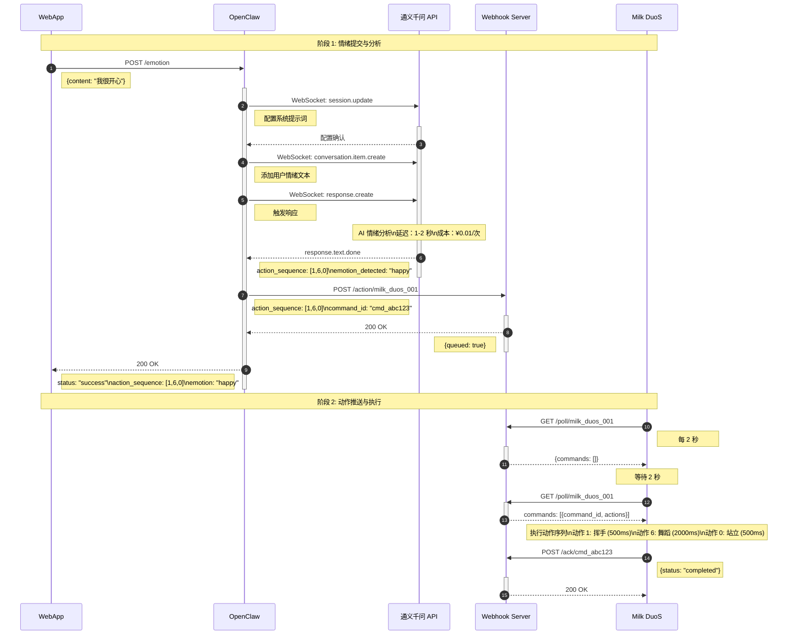
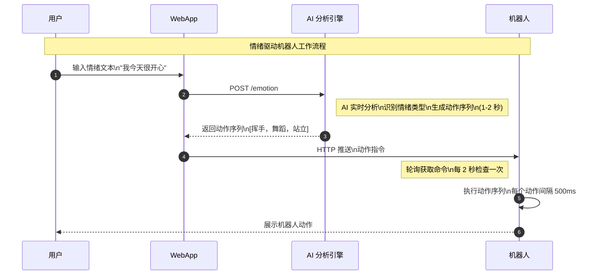
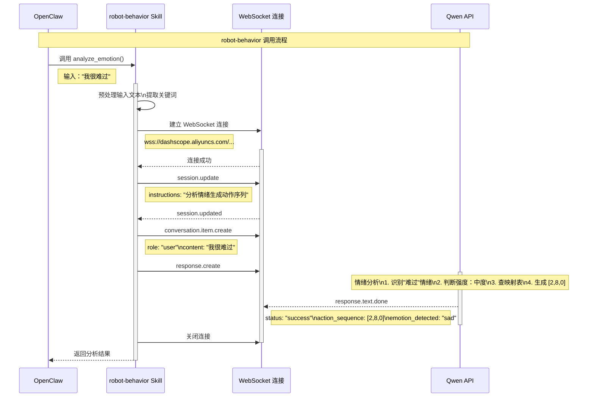
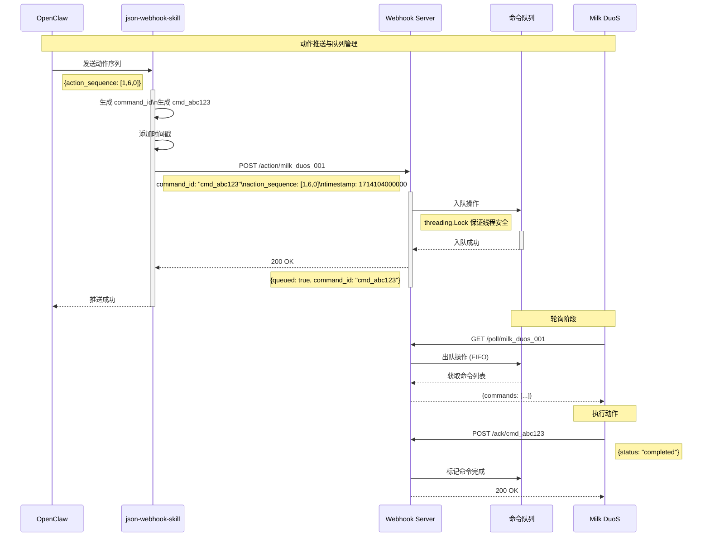
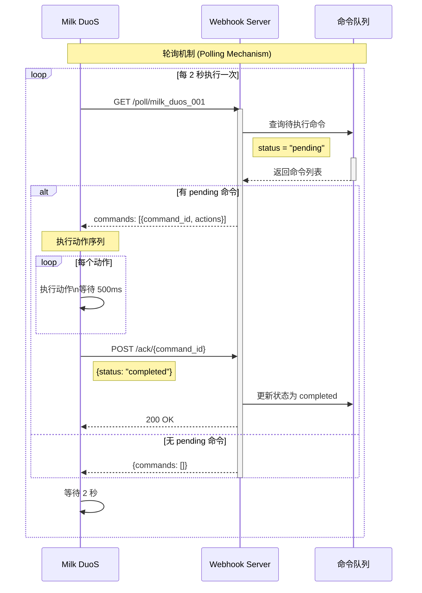
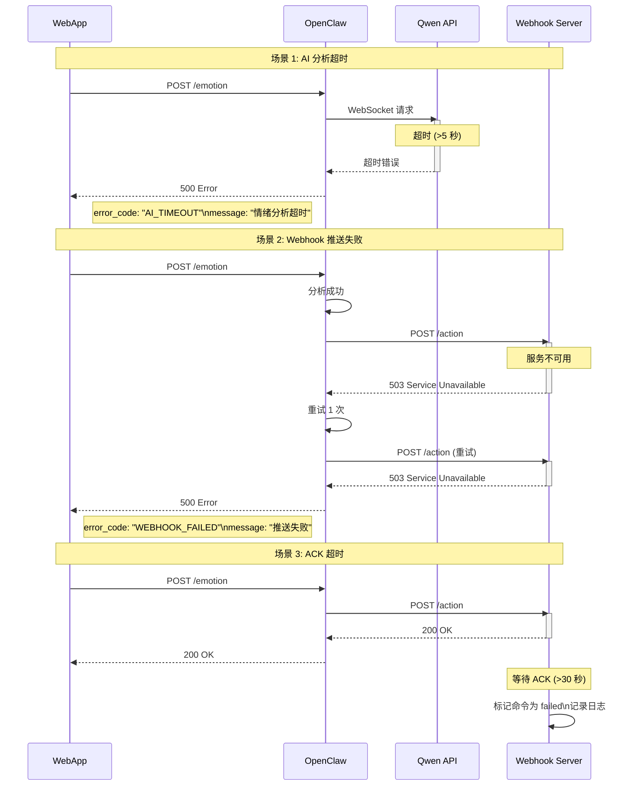
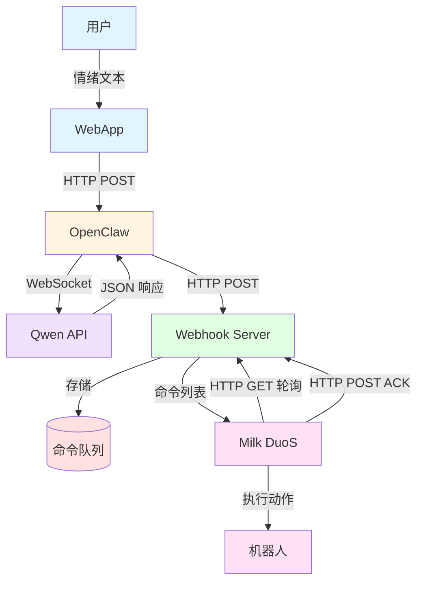

# 📊 情绪驱动机器人 - 时序图集合

**用途**：用于设计报告、汇报 PPT、技术文档  
**格式**：Mermaid (可渲染为 PNG/SVG)  
**最后更新**：2026-04-26

---

## 1. 完整端到端时序图

**用途**：设计报告 - 系统架构章节

---

## 2. 简化版时序图 (PPT 专用)

**用途**：汇报 PPT - 系统架构页 (非技术评委也能看懂)

---

## 3. AI 分析模块详细时序图

**用途**：设计报告 - AI 模块详细设计章节

---

## 4. Webhook 推送时序图

**用途**：设计报告 - Webhook 模块详细设计章节

---

## 5. 轮询机制时序图

**用途**：设计报告 - 硬件轮询模块章节

---

## 6. 错误处理时序图

**用途**：设计报告 - 错误处理章节

---

## 7. 数据流图 (DFD)

**用途**：设计报告 - 系统架构章节 (补充)

---

## 使用说明

### 渲染 Mermaid 图表

**方式 A：GitHub/GitLab**
- 直接粘贴到 Markdown 文件，自动渲染

**方式 B：VS Code**
- 安装 "Markdown Preview Mermaid Support" 插件
- 预览 Markdown 时自动渲染

**方式 C：在线编辑器**
- 访问 https://mermaid.live
- 粘贴代码，导出 PNG/SVG

**方式 D：PPT 插入**
1. 在 mermaid.live 渲染图表
2. 导出为 SVG 或 PNG
3. 插入 PPT

### 图表配色说明

| 颜色 | 含义 |
|------|------|
| 🔵 蓝色 | 用户/前端层 |
| 🟠 橙色 | AI 分析层 (OpenClaw) |
| 🟣 紫色 | 外部 API (Qwen) |
| 🟢 绿色 | 后端服务 (Webhook) |
| 🔴 红色 | 硬件/执行层 |

---

**更新日期**：2026-04-26  
**维护人**：团队 C (AI 模块负责人)
